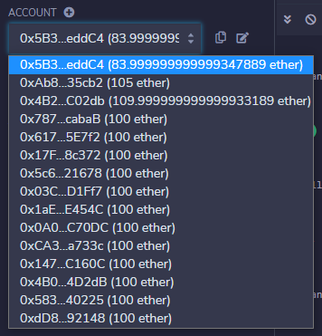

# Solidity Joint-Savings Account

---
## Overview:
A fintech startup company has recently hired you. This company is disrupting the finance industry with its own cross-border, Ethereum-compatible blockchain that connects financial institutions. Currently, the team is building smart contracts to automate many of the institutions’ financial processes and features, such as hosting joint savings accounts.

To automate the creation of joint savings accounts, you’ll create a Solidity smart contract that accepts two user addresses. These addresses will be able to control a joint savings account. Your smart contract will use ether management functions to implement a financial institution’s requirements for providing the features of the joint savings account. These features will consist of the ability to deposit and withdraw funds from the account.

---
## HOW TO RUN
### Setup:
After cloning the project repo to your local machine do the following:

1. Open/Launch [Remix - Etherreum IDE](https://remix.ethereum.org/)

2. Using the File Explorer and "default_workspace" select `Load a local file into current workspace` and using the file explorer pop-up window Navigate to the repo folder to select/open `joint_savings.sol` file

3. Within Remix select the `joint_savings.sol` file

4. Select the `Solidity Compiler` icon and set the following:
    * Compiler: 0.8.7+commit.e28d00a7
    * Language: Solidity
    * EVM Version: compiler default
    * Compiler Configuration: select only 'Auto compile'
    * Contract: JointSavings(joint_savings.sol)

5. `Compile joint_savings.sol`

6. Select the `Deploy & Run Transactions` icon and set the following:
    * Environment: JavaScript VM (London)
    * Account: Default
    * Gas Limit: 3000000
    * Value: 0 Wei
    * Contract: JointSavings - joint_savings.sol 

7. `Deploy`

8. Confirm deployment

---
### Interacting with Deployed Smart Contract
1. Use the `setAccounts` function to define the authorized Ethereum address that will be able to withdraw funds from your contract by selecting the drop-down arrow.

2. Copy 2 account addresses and paste them in the corresponding `account1` and `account2` fields within setAccounts and select `transact`

3. Confirm by selecting the drop-down arrow next to `'Debug'` in the console window

4. Test the deposit functionality of your smart contract by sending the following amounts of ether. After each transaction, use the `contractBalance` function to verify that the funds were added to your contract:

    * Transaction 1: Send 1 ether as wei.

    * Transaction 2: Send 10 ether as wei.

    * Transaction 3: Send 5 ether.

>NOTE: Remembering how to convert ether to wei and vice versa can be challenging. So, you can use a website like [Ethereum Unit Converter](https://eth-converter.com/) to ease doing the conversion.

5. Once you’ve successfully deposited funds into your contract, test the contract’s withdrawal functionality by withdrawing 5 ether into `accountOne` and 10 ether into `accountTwo`. After each transaction, use the `contractBalance` function to verify that the funds were withdrawn from your contract. Also, use the `lastToWithdraw` and `lastWithdrawAmount` functions to verify that the address and amount were correct.

    * Withdraw 5 ETH to `account1`
    

    * Withdraw 10 ETH to `account2`
    

    * Check `contractBalance` function after withdrawing
    

    * Confirm withdraw blocks
    

    * Check and confirm `lastToWithdraw` and `lastWithdrawAmount` functions
    

6. Double confirm account balances by checking `Account` addresses and their corresponding balances
